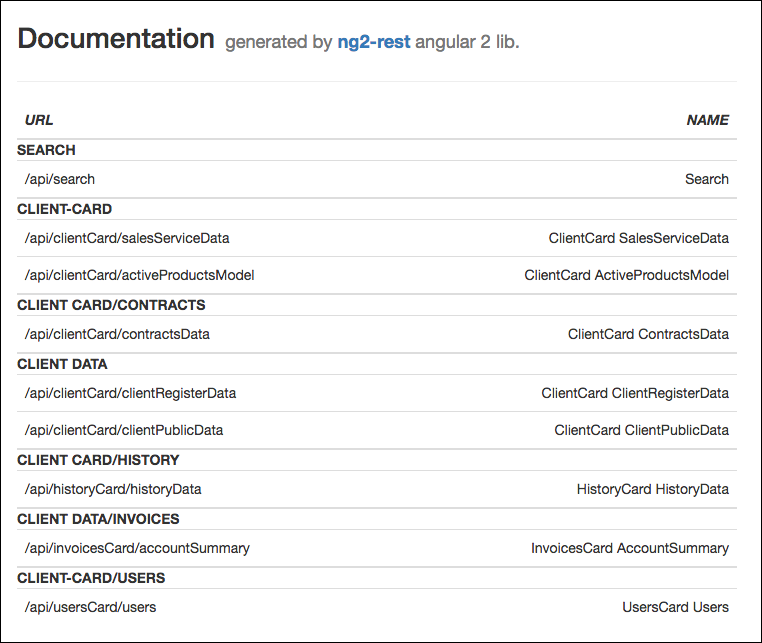

## ng2-rest-docs-server ##

Web server for documentation generated based on metadata
from angular2 apps with [ng2-rest](https://github.com/darekf77/ng2-rest)  v4.x plugin.
In your app you should enable it by setting in **app.component** or 
somewhere where your app being:

    Resource.setUrlToDocsServer('http://localhost:3333');

When you are using your app and making request by ng2-rest you will be
saving every request with his metadata to hard drive by instance of ng2-rest-docs-server
which will generate nice docs , with descriptions of requests, use cases, like this :

To recreate your docs-server each time you for ex. running tests E2E,
 you can use: 
 

    Resource.recreateServer(http); // http instance from @anguar/http

Instalation on your server:

    npm install ng2-rest-docs-server -g

**Usage ( in folder where you wanna put your docs from ng2-rest )**

simple way  (docs server is working on default port 3333 ):

    ng2-rest-docs-server 
or with parameters:

    ng2-rest-docs-server -p 3555 -b http://localhost:3333

| param | description |
| --- | --- |
| -p | port for docs web server |
| -b| base url for app witn ng2-rest v4.x |

